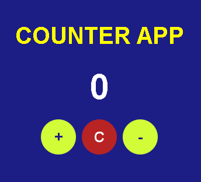

# Progetto Javascript Basics di Andrea Brandetti

Hi, in this readme I will show you how I realized this counter application using HTML, CSS and JavaScript.

<a href="https://brandijsen.github.io/Progetto-JS-BASICS-di-Andrea-Brandetti/" target="_blank"  rel="noopener">Link for the app</a>
 
<a href="https://github.com/brandijsen/Progetto-JS-BASICS-di-Andrea-Brandetti" target="_blank"  rel="noopener">Link for the Github repository</a>

## App Structure

We have an app container that includes:

- h1 with the title of the application;
- "counter" div that will contain the counter value;
- Three buttons ("increase", "reset", "decrease").

I implemented this structure using the Javascript DOM manipulation.

## CSS Style

For this project i chose a minimalist CSS style.
Every text is written in "Poppins" sans-serif bold, and the background color is blue. Title is yellow as the "increase" and "decrease" buttons, "reset" button is red. When a button get hovered his color change. Counter value color is white.

## Javascript functions:

After creating the container, I defined the app elements with an array of objects. Each object has the "type", "id", "textContent" properties. With the forEach cycle i created the elements (children) of the container (parent).

Now we can focus on the functionality of the app.

We initializes a counter variable, her value is 0. Then we defines a function named updateCounter() to update the display of the counter on the webpage.

We give an event listener to the appContainer element to handle button clicks. When a button is clicked, it checks which button was clicked and performs the corresponding action:

- If the 'incrementBtn' is clicked, counterValue is incremented.
- If the 'decrementBtn' is clicked and counterValue is greater than 0, counterValue is decremented.
- If the 'resetBtn' is clicked, counterValue is reset to 0.
  After each button click, the updateCounter() function is called to reflect the updated count value on the webpage.
