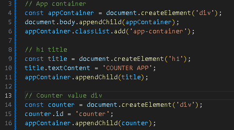
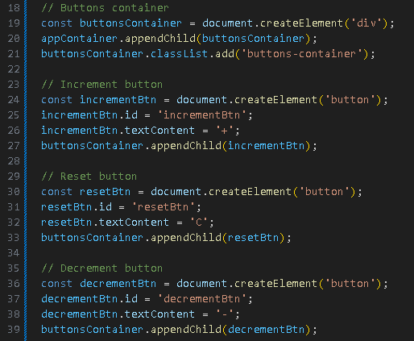
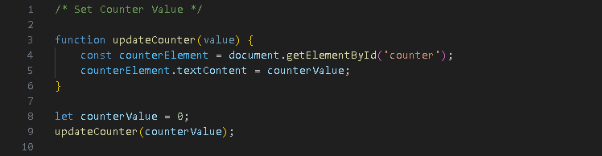
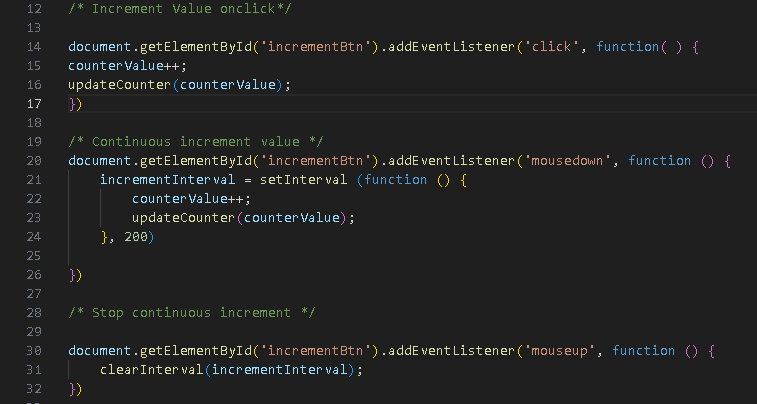
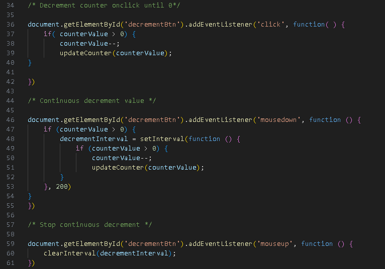
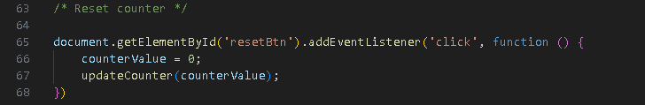

# Progetto Javascript Basics di Andrea Brandetti

Hi, in this readme I will show you how I realized this counter application using HTML, CSS and JavaScript.

[Link for the app](https://brandijsen.github.io/Progetto-JS-BASICS-di-Andrea-Brandetti/){:target="\_blank"}

[Link for the Github repository](https://github.com/brandijsen/Progetto-JS-BASICS-di-Andrea-Brandetti){:target="\_blank"}

## App Structure

We have an app container that includes:

- H1 with the title of the application;
- "counter" div that will contain the counter value;
- "button-container" div containing three buttons ("increase", "reset", "decrease").

I implemented this structure using the Javascript DOM manipulation.

## CSS Style

For this project i chose a minimalist CSS style.
Every text is written in "Poppins" sans-serif bold, and the background color is blue. Title is yellow as the "increase" and "decrease" buttons, "reset" button is red. When a button get hovered his color change. Counter value color is white.

## Javascript functions:

- We start defining "updateCounter" function and initializing "counterValue" variable.

- Increment Function

When the user press the "+" button the counter will rise until he release it, this is possible thanks to the "onclick" and "mousedown" events. "mouseup" event will stop the counter.

- Decrement Function

We use the same process for the "-" button. The counter will fall until the user release it. Of course, this is possible just if the counter value is higher than 0.

- Reset Function

When the user press the button "C" the counter will reset its value and it set on 0.

